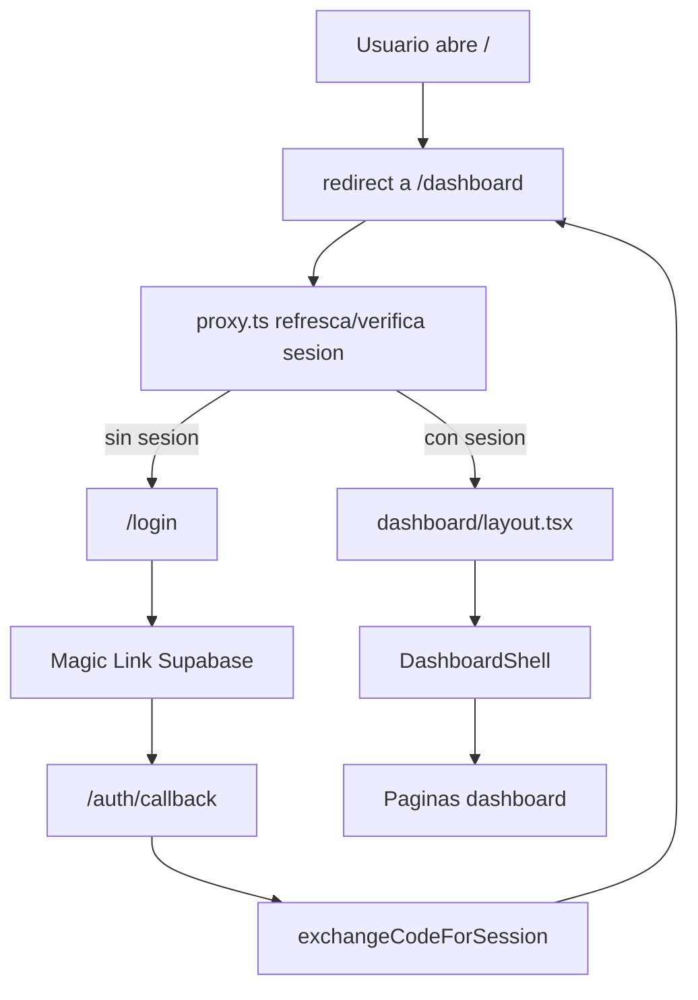
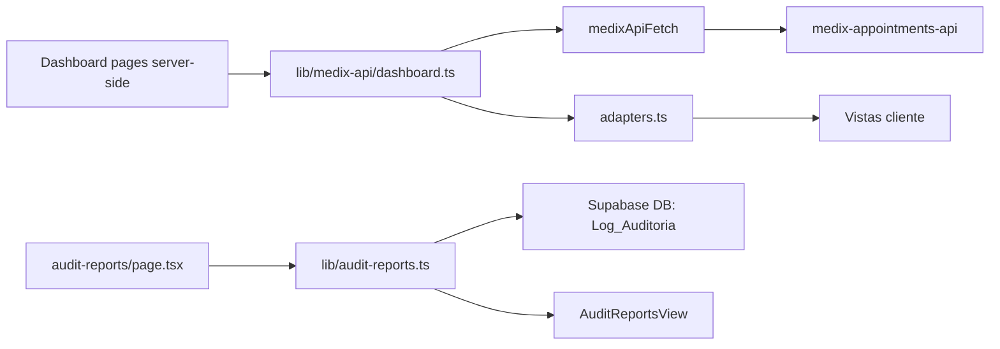
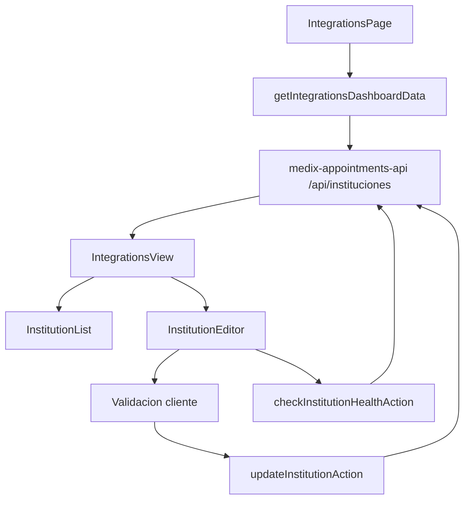

# Arquitectura del codigo

Guia breve para entender el portal admin Medix.

## Stack

- Next.js 16 App Router
- React 19
- TypeScript
- Tailwind CSS 4
- Supabase Auth y Supabase DB
- API externa `medix-appointments-api`

## Estructura principal

```text
src/
  app/                     Rutas, layouts y server actions
  components/              UI reutilizable y vistas cliente
  lib/
    supabase/              Clientes Supabase y refresco de sesion
    medix-api/             Cliente HTTP, tipos API y adaptadores
    audit-reports.ts       Consulta y normalizacion de auditoria
  types/admin.ts           Tipos UI del dashboard
  proxy.ts                 Middleware/proxy de sesion
public/
  logo_medix_bg.png        Logo usado en login/sidebar
```

## Flujo general



## Flujo de datos del dashboard



## Rutas principales

| Ruta | Archivo | Funcion |
|---|---|---|
| `/` | `src/app/page.tsx` | Redirige a `/dashboard`. |
| `/login` | `src/app/login/page.tsx` | Formulario Magic Link. |
| `/auth/callback` | `src/app/auth/callback/route.ts` | Intercambia codigo por sesion. |
| `/dashboard` | `src/app/dashboard/page.tsx` | Home operativo. |
| `/dashboard/users` | `src/app/dashboard/users/page.tsx` | Pacientes. |
| `/dashboard/appointments` | `src/app/dashboard/appointments/page.tsx` | Citas por IPS. |
| `/dashboard/integrations` | `src/app/dashboard/integrations/page.tsx` | Gestion IPS y health check. |
| `/dashboard/audit-reports` | `src/app/dashboard/audit-reports/page.tsx` | Auditoria. |

## Modulos clave

### Autenticacion

- `src/proxy.ts`: protege `/login` y `/dashboard`.
- `src/lib/supabase/update-session.ts`: refresca cookies de Supabase.
- `src/lib/supabase/server-client.ts`: cliente Supabase para Server Components/actions.
- `src/lib/supabase/browser-client.ts`: cliente Supabase para login cliente.

### API Medix

- `src/lib/medix-api/client.ts`: fetch autenticado con token Supabase.
- `src/lib/medix-api/dashboard.ts`: loaders server-side para vistas.
- `src/lib/medix-api/types.ts`: contratos de respuesta/payload API.
- `src/lib/medix-api/adapters.ts`: transforma API snake_case a tipos UI.

### Auditoria

- `src/lib/audit-reports.ts`: lee `Log_Auditoria`, parsea `detalle` y calcula campos utiles.
- `src/components/dashboard/audit-reports-view.tsx`: filtros, metricas, detalle y scroll incremental.

### Integraciones IPS



## Variables de entorno

```env
NEXT_PUBLIC_SUPABASE_URL=
NEXT_PUBLIC_SUPABASE_ANON_KEY=
MEDIX_API_URL=
```

`MEDIX_API_URL` usa `http://localhost:8001` por defecto si no esta definida.

## Comandos

```bash
npm install
npm run dev
npm run lint
npm run build
npm run start
```

## Pendientes recomendados

- Definir gestor oficial: `npm` o `bun`.
- Agregar tests unitarios para adaptadores, auditoria y validaciones.
- Confirmar autorizacion por rol/admin en Supabase o API.
- Documentar contrato real de `estado` de instituciones.
- Evaluar separar subcomponentes de Integraciones a archivos propios si siguen creciendo.

